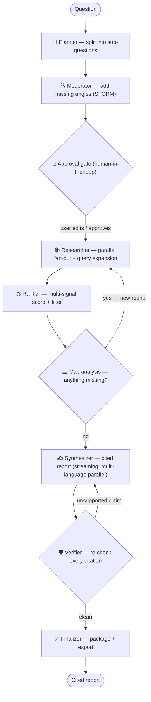

# Advanced Web Search

**🌐 English · [Türkçe](README.tr.md)**

> A local-first, login-free, multi-agent **deep-research workbench** that turns one question
> into a citation-verified report across the web *and* academic literature — scoring sources by
> **quality, not popularity**, and showing its work the whole way.

Runs with **zero API keys** out of the box (keyless web + academic sources and a local Ollama
model). Add a cloud key and it automatically upgrades the model. Everything — projects, runs,
sources, embeddings, claims and reports — lives in a single local SQLite file.

---

## Table of contents

1. [Why this project exists](#1-why-this-project-exists)
2. [Project structure](#2-project-structure)
3. [Installation & setup](#3-installation--setup)
4. [Configuration](#4-configuration)
5. [Architecture reference](#5-architecture-reference)
6. [License](#6-license)

---

## 1. Why this project exists

Most "research" today happens in one of two places, and both are a poor fit for serious work:

**🔎 Popularity-ranked search engines** answer the question *"what is most clicked / most
optimized / most advertised?"* — not *"what is most credible, current and relevant to my
question?"* You get a ranked list of links with no reasoning, no academic depth, and no memory
of what you found yesterday.

**💬 Cloud chat / "deep research" tools** are opaque black boxes: they send your text to a
third party, hide *how* a source was chosen, can't be steered before they spend tokens, rarely
re-check their own citations, and keep none of it on your machine.

**Advanced Web Search is built for the researcher who needs to trust the result.** It is:

| | What that means in practice |
| --- | --- |
| **Local-first & private** | Embeddings, reranking, storage and search all run on your machine. Your text never has to leave it. No account, no telemetry. |
| **Quality over popularity** | Every kept source is scored on five transparent signals (relevance, authority, recency, citation impact, evidence type) and shows a *"why kept"* breakdown — never an opaque rank. |
| **Academic + web, in parallel** | Fans out across keyless web search **and** seven academic databases (OpenAlex, Crossref, arXiv, Europe PMC, Semantic Scholar, DOAJ, PubMed) at once. |
| **Steerable** | A human-in-the-loop **approval gate** lets you edit the nested sub-topic plan *before* expensive retrieval runs. |
| **Self-checking** | An **adversarial verifier** re-reads every cited source and labels it *supports / contradicts / dead link* — unsupported claims are sent back for revision. |
| **Multilingual** | Local `bge-m3` embeddings with strong **Turkish** support; bilingual TR/EN UI; reports can be generated in **one or several languages in parallel**. |
| **Persistent** | Projects, runs, sources, claims and reports are saved in SQLite and revisitable — nothing is thrown away after a query. |
| **One command, Windows-first** | `./start.ps1` (or `./start.sh`) installs, builds and launches. No curl-pipe-bash, no wizard. |

The reference point is **Feynman** (an arXiv-only, terminal-only, cloud-bound CLI). Advanced Web
Search is a GUI-first, offline-capable, multi-database alternative with persistent storage and
verifiable citations.

---

## 2. Project structure

### Visual — repository layout

```
advanced-web-search/
├── backend/
│   └── advanced_web_search/        # Python package (FastAPI + LangGraph)
│       ├── api/                    # FastAPI app + routers
│       │   ├── main.py             #   app factory, SPA mount, /api router wiring
│       │   ├── routes_research.py  #   start a run, SSE trace stream, approve/cancel
│       │   ├── routes_projects.py  #   projects CRUD + per-run reports
│       │   ├── routes_sources.py   #   sources, per-source citation, reports
│       │   ├── routes_settings.py  #   model/weights settings, LLM connection test
│       │   └── routes_export.py    #   BibTeX / RIS / CSL / Markdown / printable HTML
│       ├── graph/                  # the multi-agent orchestration graph
│       │   ├── builder.py          #   wires the LangGraph DAG + HITL interrupt + loops
│       │   ├── runner.py           #   drives a run, resumes, streams custom events
│       │   ├── state.py            #   ResearchState (typed shared state)
│       │   ├── events.py           #   SSE event emitter
│       │   └── nodes/              #   one file per agent:
│       │       ├── planner.py      #     splits the question into sub-topics
│       │       ├── moderator.py    #     adds missing angles (STORM-style)
│       │       ├── approval.py     #     human-in-the-loop gate (interrupt)
│       │       ├── researcher.py   #     parallel fan-out + query expansion + full-text
│       │       ├── ranker.py       #     multi-signal scoring + filtering
│       │       ├── gap.py          #     gap analysis → loop back for more rounds
│       │       ├── synthesizer.py  #     writes the cited report (multi-language, parallel)
│       │       ├── verifier.py     #     adversarial citation re-check
│       │       └── finalizer.py    #     packages + finishes the run
│       ├── sources/                # search providers (base + registry + 13 providers)
│       │   ├── web_*.py            #   DuckDuckGo, SearXNG, Tavily, Brave
│       │   ├── academic_*.py       #   OpenAlex, Crossref, arXiv, Europe PMC,
│       │   │                       #   Semantic Scholar, DOAJ, PubMed, CORE, Unpaywall
│       │   ├── snowball.py         #   citation snowballing (OpenAlex refs/cites)
│       │   └── fulltext.py         #   OA PDF → text extraction
│       ├── retrieval/              # dedup + sqlite-vec vector store
│       ├── scoring/                # weighted source ranker (the score formula)
│       ├── embeddings/             # bge-m3 embedder + bge-reranker (fastembed ONNX)
│       ├── llm/                    # provider routing (Ollama/cloud) + RAM-based model pick
│       ├── db/                     # SQLite schema, migrations, repositories
│       ├── models/                 # Pydantic request/response schemas
│       ├── utils/                  # safe HTTP (SSRF guard) + text helpers
│       ├── config.py               # settings, depth presets, report-language config
│       ├── export.py               # citation/report exporters
│       ├── cli.py / __main__.py    # `advanced-web-search` entry point
│       └── web/                    # built SPA (generated by the frontend build; git-ignored)
├── frontend/
│   └── src/                        # React 19 + Vite + Tailwind single-page app
│       ├── pages/                  #   Home, Research, Settings, About (project structure)
│       ├── components/             #   AgentTrace, TopicGraph, SourceTable, ReportView,
│       │   │                       #   ExportMenu, ApprovalPanel, ScoreWeights, …
│       │   └── ui/                 #   small design-system primitives (button, card, …)
│       └── lib/                    #   api client, SSE stream, i18n, types, languages
├── scripts/                        # dev.py (concurrent backend+frontend hot reload)
├── tests/                          # offline end-to-end graph tests (deterministic fakes)
├── brand/                          # logo / brand assets
├── start.ps1 / start.sh            # one-command launchers
├── pyproject.toml                  # Python package + dependencies
└── .env.example                    # all (optional) configuration keys
```

### Visual — the agent pipeline



### Written — how the layers fit together

- **Frontend (`frontend/`)** — a three-pane React workspace: a live **agent trace** (server-sent
  events), an interactive **topic graph**, and the **report + source table** with per-source
  scoring chips. Talks to the backend only through `/api` (JSON) and an SSE stream.
- **API (`backend/.../api/`)** — FastAPI serves both the JSON API under `/api` and the built SPA
  as a catch-all, so the whole app is one process on one port.
- **Orchestration (`backend/.../graph/`)** — a **LangGraph** state machine runs the agent pipeline
  above. It checkpoints to SQLite (so a run can pause at the approval gate and resume), loops for
  gap-filling and citation repair, and streams every step to the UI.
- **Retrieval & scoring (`sources/`, `retrieval/`, `scoring/`, `embeddings/`)** — providers fan
  out in parallel; results are de-duplicated, embedded and reranked locally with `bge-m3`, fused
  with keyword search via Reciprocal Rank Fusion, then scored by the transparent weighted formula.
- **LLM (`llm/`)** — a hybrid router: it uses a local Ollama model by default and automatically
  upgrades to a cloud provider the moment an API key is present.
- **Storage (`db/`)** — a single SQLite file holds relational data **and** the vector index
  (`sqlite-vec`) **and** full-text search (FTS5). One file you can copy, back up, or delete.

---

## 3. Installation & setup

### Prerequisites

- **Python 3.11–3.13** — required (the backend runtime).
- **Node 18+ and `pnpm`** — *optional*, only needed to build the SPA from source. Not needed at
  runtime once `backend/advanced_web_search/web/` exists.
- **Ollama** — *optional*, install from <https://ollama.com> for a fully offline LLM.
- **API keys** — *optional*; any cloud key auto-upgrades the default model.

### Step 1 — Get the code

```bash
git clone https://github.com/FurkanSahinnn/advanced-web-search.git
cd advanced-web-search
```

### Step 2 — (Recommended) create a Python environment

Using **conda**:

```bash
conda create -n myenv python=3.12 -y
conda activate myenv
```

> If you skip this, the launcher will create a local `.venv` for you as a last resort. It will
> **never** overwrite an active conda env — if `CONDA_PREFIX` is set, it installs into that env.

### Step 3 — Launch (one command)

**Windows (PowerShell):**

```powershell
./start.ps1
```

**macOS / Linux:**

```bash
./start.sh
```

This single command: picks your Python environment → installs the backend in editable mode
(`pip install -e .`) → builds the SPA if it hasn't been built (`pnpm install && pnpm build`) →
starts the server and opens your browser at **http://127.0.0.1:8787**.

Pass-through flags work, e.g. `./start.ps1 --port 9000 --no-browser`.

### Step 4 — (Optional) enable a fully-offline local model

Install [Ollama](https://ollama.com), then pull a model sized to your machine (auto-detected):

```bash
ollama pull qwen3:8b      # good default for ~16–32 GB RAM
```

### Step 5 — (Optional) add cloud API keys

```bash
cp .env.example .env      # then edit .env and uncomment the keys you want
```

Adding any cloud key (e.g. `ANTHROPIC_API_KEY`) automatically upgrades the LLM — no further
configuration needed. See [Configuration](#4-configuration).

### Manual install (if you'd rather not use the launcher)

```bash
pip install -e .                          # backend (editable)
pnpm --dir frontend install               # frontend deps
pnpm --dir frontend build                 # builds into backend/.../web/
python -m advanced_web_search             # launch (http://127.0.0.1:8787)
```

### Development mode (hot reload)

```bash
python scripts/dev.py                     # backend :8787 + Vite :5173 (proxies /api)
```

Open **http://localhost:5173** while developing.

### Running the tests

```bash
pip install -e ".[dev]"                   # ruff + pytest + pytest-asyncio
pytest tests/ -q                          # deterministic, fully offline (no LLM/network)
```

---

## 4. Configuration

A `.env` file is **completely optional** — Advanced Web Search runs with zero keys. Copy
`.env.example` to `.env` and set only what you want:

| Key | Purpose |
| --- | --- |
| `ANTHROPIC_API_KEY` / `OPENAI_API_KEY` / `GEMINI_API_KEY` / `GROQ_API_KEY` / `DEEPSEEK_API_KEY` / `OPENROUTER_API_KEY` | Auto-upgrade the LLM (priority: Anthropic > OpenAI > Gemini > Groq > DeepSeek > OpenRouter). |
| `AWSEARCH_OLLAMA_BASE_URL` | Custom Ollama endpoint (default `http://localhost:11434`). |
| `AWSEARCH_LOCAL_MODEL` | Force a specific local model instead of the RAM-based auto-pick. |
| `TAVILY_API_KEY` / `BRAVE_API_KEY` | Optional managed / independent web search. |
| `AWSEARCH_SEARXNG_URL` | Optional self-hosted SearXNG instance. |
| `OPENALEX_API_KEY` / `SEMANTIC_SCHOLAR_API_KEY` / `CORE_API_KEY` | Higher academic rate limits + extra ranking signals + OA full text. |
| `AWSEARCH_CONTACT_EMAIL` | Polite-pool email for Crossref / Unpaywall / OpenAlex. |
| `AWSEARCH_HOST` / `AWSEARCH_PORT` / `AWSEARCH_DATA_DIR` / `AWSEARCH_LOG_LEVEL` | Server + storage overrides. |

> ⚠️ **Never commit your real `.env`.** It is already git-ignored. If a key ever leaks, rotate it.

---

## 5. Architecture reference

| Layer | Stack |
| --- | --- |
| Frontend | React 19, Vite, Tailwind, `@xyflow/react`, react-markdown + KaTeX |
| API | FastAPI + `sse-starlette` (JSON under `/api`, SSE trace stream) |
| Orchestration | LangGraph (multi-node agent graph, SQLite checkpointer, HITL interrupt) |
| LLM | LiteLLM — hybrid routing between local Ollama and cloud providers |
| Embeddings / rerank | `fastembed` ONNX: `bge-m3` embeddings + `bge-reranker` (multilingual) |
| Storage / retrieval | SQLite + `sqlite-vec` + FTS5, fused with RRF |

**Source-scoring formula** (weights normalized to sum to 1):

```
final_score = 0.40·relevance + 0.15·authority + 0.15·recency
            + 0.15·citation_impact + 0.15·evidence
```

A source is kept when `final_score ≥ keep_threshold` (default `0.45`); weights and threshold are
adjustable in Settings.

---

## 6. License

[MIT](LICENSE) © Advanced Web Search contributors.
