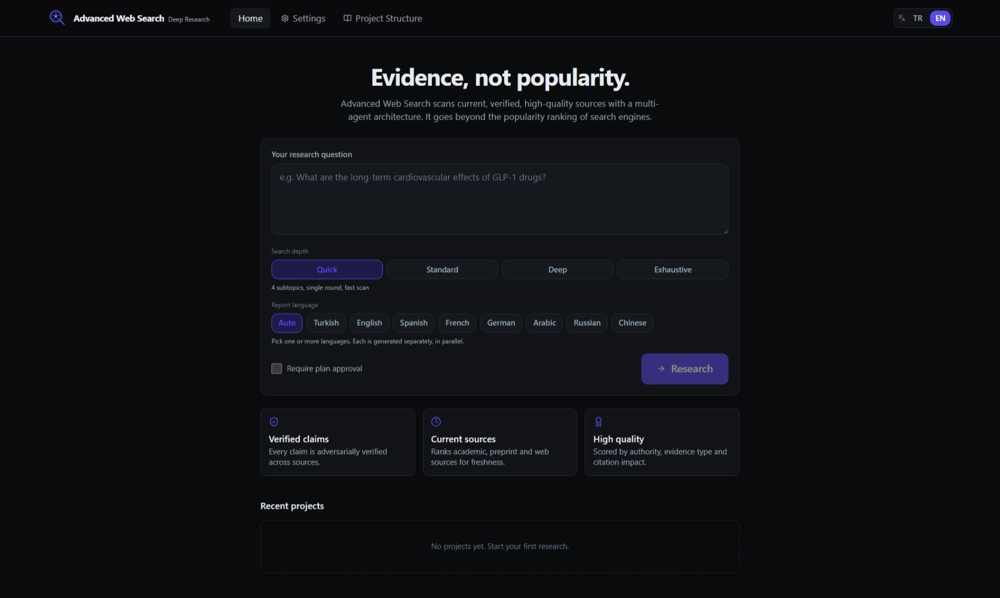
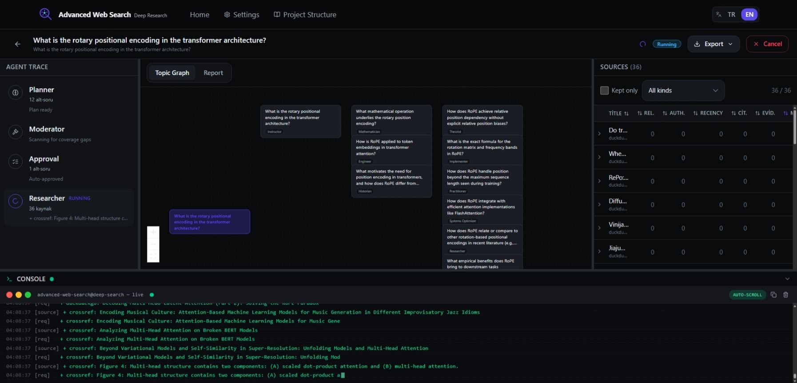
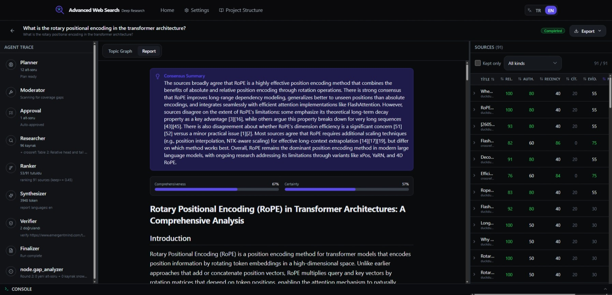
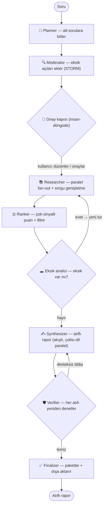

# Advanced Web Search

**[English](README.md) · 🌐 Türkçe**

> Bir araştırma sorusunu, web **ve** akademik literatür genelinde kaynakçası doğrulanmış bir
> rapora dönüştüren; **tamamen yerel çalışan**, hesap/giriş gerektirmeyen, çok-ajanlı bir
> **derin araştırma çalışma tezgâhı**. Kaynakları **popülerliğe değil, kaliteye** göre puanlar
> ve yaptığı her adımı şeffaf biçimde gösterir.

Kutudan çıktığı haliyle **sıfır API anahtarı** ile çalışır (anahtarsız web + akademik kaynaklar ve
yerel bir Ollama modeli). Bir bulut anahtarı eklediğiniz an modeli otomatik olarak yükseltir.
Her şey — projeler, çalıştırmalar, kaynaklar, embedding'ler, iddialar ve raporlar — tek bir yerel
SQLite dosyasında durur.

---

## Ekran görüntüleri

**Ana sayfa — araştırma sorunuzu yazın, arama derinliğini ve rapor dil(ler)ini seçin**



**Canlı araştırma — ajan izi, konu grafiği ve puanlanmış kaynaklar gerçek zamanlı akar**



**Atıflı rapor — satır içi [n] atıfları ve bir uzlaşı özeti içeren sentezlenmiş yanıt**



---

## İçindekiler

- [Ekran görüntüleri](#ekran-görüntüleri)

1. [Bu proje neden var](#1-bu-proje-neden-var)
2. [Proje yapısı](#2-proje-yapısı)
3. [Kurulum ve hazırlık](#3-kurulum-ve-hazırlık)
4. [Yapılandırma](#4-yapılandırma)
5. [Mimari referansı](#5-mimari-referansı)
6. [Lisans](#6-lisans)

---

## 1. Bu proje neden var

Bugün "araştırma" çoğunlukla iki yerden birinde yapılıyor ve ikisi de ciddi iş için yetersiz:

**🔎 Popülerliğe göre sıralayan arama motorları** şu soruyu yanıtlar: *"en çok tıklanan / en iyi
optimize edilmiş / en çok reklamı yapılan nedir?"* — *"sorum için en güvenilir, en güncel ve en
ilgili olan nedir?"* değil. Elinize, hiçbir gerekçe içermeyen, akademik derinliği olmayan ve dün
ne bulduğunuzu hatırlamayan bir bağlantı listesi geçer.

**💬 Bulut sohbet / "derin araştırma" araçları** ise kapalı kutudur: metninizi üçüncü bir tarafa
gönderir, bir kaynağın *neden* seçildiğini gizler, token harcamadan önce yönlendirilemez, kendi
atıflarını nadiren yeniden denetler ve hiçbirini sizin makinenizde tutmaz.

**Advanced Web Search, sonuca güvenmesi gereken araştırmacı için tasarlandı.** Şöyle:

| | Pratikte ne anlama geldiği |
| --- | --- |
| **Yerel-öncelikli ve gizli** | Embedding, yeniden sıralama, depolama ve arama tamamen sizin makinenizde çalışır. Metniniz makineden çıkmak zorunda değildir. Hesap yok, telemetri yok. |
| **Popülerlik değil, kalite** | Tutulan her kaynak beş şeffaf sinyalle puanlanır (ilgililik, otorite, güncellik, atıf etkisi, kanıt türü) ve bir *"neden tutuldu"* dökümü gösterir — asla kapalı bir sıralama değil. |
| **Akademik + web, paralel** | Anahtarsız web araması **ve** yedi akademik veritabanı (OpenAlex, Crossref, arXiv, Europe PMC, Semantic Scholar, DOAJ, PubMed) aynı anda taranır. |
| **Yönlendirilebilir** | İnsan-döngüde **onay kapısı**, pahalı arama başlamadan *önce* iç içe alt-konu planını düzenlemenize izin verir. |
| **Kendini denetleyen** | **Çelişkili (adversarial) doğrulayıcı**, atıf yapılan her kaynağı yeniden okur ve *destekliyor / çelişiyor / ölü bağlantı* olarak etiketler — desteksiz iddialar revizyona geri gönderilir. |
| **Çok dilli** | Güçlü **Türkçe** desteğiyle yerel `bge-m3` embedding'leri; iki dilli TR/EN arayüz; raporlar **bir veya birden çok dilde paralel** üretilebilir. |
| **Kalıcı** | Projeler, çalıştırmalar, kaynaklar, iddialar ve raporlar SQLite'ta saklanır ve tekrar açılabilir — bir sorgudan sonra hiçbir şey atılmaz. |
| **Tek komut, Windows-öncelikli** | `./start.ps1` (veya `./start.sh`) kurar, derler ve başlatır. curl-pipe-bash yok, sihirbaz yok. |

Karşılaştırma noktası **Feynman** (yalnızca arXiv, yalnızca terminal, buluta bağımlı bir CLI).
Advanced Web Search; kalıcı depolama ve doğrulanabilir atıflara sahip, GUI-öncelikli, çevrimdışı
çalışabilen, çok-veritabanlı bir alternatiftir.

---

## 2. Proje yapısı

### Görsel — depo düzeni

```
advanced-web-search/
├── backend/
│   └── advanced_web_search/        # Python paketi (FastAPI + LangGraph)
│       ├── api/                    # FastAPI uygulaması + router'lar
│       │   ├── main.py             #   uygulama fabrikası, SPA mount, /api bağlama
│       │   ├── routes_research.py  #   çalıştırma başlat, SSE iz akışı, onay/iptal
│       │   ├── routes_projects.py  #   proje CRUD + çalıştırma başına raporlar
│       │   ├── routes_sources.py   #   kaynaklar, kaynak başına atıf, raporlar
│       │   ├── routes_settings.py  #   model/ağırlık ayarları, LLM bağlantı testi
│       │   └── routes_export.py    #   BibTeX / RIS / CSL / Markdown / yazdırılabilir HTML
│       ├── graph/                  # çok-ajanlı orkestrasyon grafiği
│       │   ├── builder.py          #   LangGraph DAG'ı + HITL interrupt + döngüler
│       │   ├── runner.py           #   çalıştırmayı sürer, devam ettirir, olay akıtır
│       │   ├── state.py            #   ResearchState (tipli paylaşılan durum)
│       │   ├── events.py           #   SSE olay yayıcı
│       │   └── nodes/              #   her ajan için bir dosya:
│       │       ├── planner.py      #     soruyu alt-konulara böler
│       │       ├── moderator.py    #     eksik açıları ekler (STORM tarzı)
│       │       ├── approval.py     #     insan-döngüde onay kapısı (interrupt)
│       │       ├── researcher.py   #     paralel fan-out + sorgu genişletme + tam metin
│       │       ├── ranker.py       #     çok-sinyalli puanlama + filtreleme
│       │       ├── gap.py          #     eksik analizi → yeni tur için geri döngü
│       │       ├── synthesizer.py  #     atıflı raporu yazar (çoklu-dil, paralel)
│       │       ├── verifier.py     #     çelişkili atıf yeniden denetimi
│       │       └── finalizer.py    #     paketler + çalıştırmayı bitirir
│       ├── sources/                # arama sağlayıcıları (base + registry + 13 sağlayıcı)
│       │   ├── web_*.py            #   DuckDuckGo, SearXNG, Tavily, Brave
│       │   ├── academic_*.py       #   OpenAlex, Crossref, arXiv, Europe PMC,
│       │   │                       #   Semantic Scholar, DOAJ, PubMed, CORE, Unpaywall
│       │   ├── snowball.py         #   atıf kartopu (OpenAlex referans/atıf)
│       │   └── fulltext.py         #   açık erişim PDF → metin çıkarımı
│       ├── retrieval/              # tekilleştirme + sqlite-vec vektör deposu
│       ├── scoring/                # ağırlıklı kaynak sıralayıcı (puan formülü)
│       ├── embeddings/             # bge-m3 embedder + bge-reranker (fastembed ONNX)
│       ├── llm/                    # sağlayıcı yönlendirme (Ollama/bulut) + RAM'e göre model seçimi
│       ├── db/                     # SQLite şeması, migration'lar, repository'ler
│       ├── models/                 # Pydantic istek/yanıt şemaları
│       ├── utils/                  # güvenli HTTP (SSRF koruması) + metin yardımcıları
│       ├── config.py               # ayarlar, derinlik ön-tanımları, rapor-dili yapılandırması
│       ├── export.py               # atıf/rapor dışa aktarıcıları
│       ├── cli.py / __main__.py    # `advanced-web-search` giriş noktası
│       └── web/                    # derlenmiş SPA (frontend build üretir; git-ignore'lu)
├── frontend/
│   └── src/                        # React 19 + Vite + Tailwind tek-sayfa uygulama
│       ├── pages/                  #   Home, Research, Settings, About (proje yapısı)
│       ├── components/             #   AgentTrace, TopicGraph, SourceTable, ReportView,
│       │   │                       #   ExportMenu, ApprovalPanel, ScoreWeights, …
│       │   └── ui/                 #   küçük tasarım-sistemi parçaları (button, card, …)
│       └── lib/                    #   api istemcisi, SSE akışı, i18n, tipler, diller
├── scripts/                        # dev.py (eşzamanlı backend+frontend hot reload)
├── tests/                          # çevrimdışı uçtan-uca grafik testleri (deterministik sahteler)
├── brand/                          # logo / marka varlıkları
├── start.ps1 / start.sh            # tek-komut başlatıcılar
├── pyproject.toml                  # Python paketi + bağımlılıklar
└── .env.example                    # tüm (opsiyonel) yapılandırma anahtarları
```

### Görsel — ajan hattı



### Yazılı — katmanlar nasıl birleşiyor

- **Frontend (`frontend/`)** — üç bölmeli bir React çalışma alanı: canlı bir **ajan izi**
  (server-sent events), etkileşimli bir **konu grafiği** ve kaynak başına puan rozetleriyle
  **rapor + kaynak tablosu**. Backend ile yalnızca `/api` (JSON) ve bir SSE akışı üzerinden konuşur.
- **API (`backend/.../api/`)** — FastAPI hem `/api` altındaki JSON API'yi hem de derlenmiş SPA'yı
  catch-all olarak sunar; böylece tüm uygulama tek portta tek bir süreçtir.
- **Orkestrasyon (`backend/.../graph/`)** — bir **LangGraph** durum makinesi yukarıdaki ajan hattını
  çalıştırır. SQLite'a checkpoint atar (çalıştırma onay kapısında duraklayıp devam edebilir),
  eksik tamamlama ve atıf onarımı için döngü kurar ve her adımı arayüze akıtır.
- **Arama ve puanlama (`sources/`, `retrieval/`, `scoring/`, `embeddings/`)** — sağlayıcılar
  paralel açılır; sonuçlar tekilleştirilir, yerel olarak `bge-m3` ile embed edilip yeniden
  sıralanır, Reciprocal Rank Fusion ile anahtar-kelime aramasıyla birleştirilir ve şeffaf
  ağırlıklı formülle puanlanır.
- **LLM (`llm/`)** — hibrit bir yönlendirici: varsayılan olarak yerel bir Ollama modeli kullanır ve
  bir API anahtarı bulunduğu an otomatik olarak bir bulut sağlayıcısına yükseltir.
- **Depolama (`db/`)** — tek bir SQLite dosyası ilişkisel veriyi **ve** vektör indeksini
  (`sqlite-vec`) **ve** tam-metin aramayı (FTS5) bir arada tutar. Kopyalayabileceğiniz,
  yedekleyebileceğiniz veya silebileceğiniz tek bir dosya.

---

## 3. Kurulum ve hazırlık

### Ön koşullar

- **Python 3.11–3.13** — gerekli (backend çalışma zamanı).
- **Node 18+ ve `pnpm`** — *opsiyonel*, yalnızca SPA'yı kaynaktan derlemek için gerekir.
  `backend/advanced_web_search/web/` bir kez oluştuktan sonra çalışma zamanında gerekmez.
- **Ollama** — *opsiyonel*, tamamen çevrimdışı LLM için <https://ollama.com> adresinden kurun.
- **API anahtarları** — *opsiyonel*; herhangi bir bulut anahtarı varsayılan modeli yükseltir.

### Adım 1 — Kodu alın

```bash
git clone https://github.com/FurkanSahinnn/advanced-web-search.git
cd advanced-web-search
```

### Adım 2 — (Önerilir) bir Python ortamı oluşturun

**conda** ile:

```bash
conda create -n myenv python=3.12 -y
conda activate myenv
```

> Bu adımı atlarsanız, başlatıcı son çare olarak sizin için yerel bir `.venv` oluşturur. Aktif bir
> conda ortamının **üzerine asla yazmaz** — `CONDA_PREFIX` ayarlıysa kurulumu o ortama yapar.

### Adım 3 — Başlatın (tek komut)

**Windows (PowerShell):**

```powershell
./start.ps1
```

**macOS / Linux:**

```bash
./start.sh
```

Bu tek komut: Python ortamınızı seçer → backend'i düzenlenebilir kipte kurar
(`pip install -e .`) → henüz derlenmemişse SPA'yı derler (`pnpm install && pnpm build`) →
sunucuyu başlatır ve tarayıcınızı **http://127.0.0.1:8787** adresinde açar.

Geçişli bayraklar çalışır, ör. `./start.ps1 --port 9000 --no-browser`.

### Adım 4 — (Opsiyonel) tamamen çevrimdışı yerel modeli etkinleştirin

[Ollama](https://ollama.com)'yı kurun, ardından makinenize uygun (otomatik tespit edilen) bir model çekin:

```bash
ollama pull qwen3:8b      # ~16–32 GB RAM için iyi bir varsayılan
```

### Adım 5 — (Opsiyonel) bulut API anahtarları ekleyin

```bash
cp .env.example .env      # ardından .env'i düzenleyip istediğiniz anahtarları açın
```

Herhangi bir bulut anahtarı (ör. `ANTHROPIC_API_KEY`) eklemek LLM'i otomatik olarak yükseltir —
başka yapılandırma gerekmez. Bkz. [Yapılandırma](#4-yapılandırma).

### Elle kurulum (başlatıcıyı kullanmak istemezseniz)

```bash
pip install -e .                          # backend (düzenlenebilir)
pnpm --dir frontend install               # frontend bağımlılıkları
pnpm --dir frontend build                 # backend/.../web/ içine derler
python -m advanced_web_search             # başlat (http://127.0.0.1:8787)
```

### Geliştirme kipi (hot reload)

```bash
python scripts/dev.py                     # backend :8787 + Vite :5173 (/api'yi proxy'ler)
```

Geliştirme sırasında **http://localhost:5173** adresini açın.

### Testleri çalıştırma

```bash
pip install -e ".[dev]"                   # ruff + pytest + pytest-asyncio
pytest tests/ -q                          # deterministik, tamamen çevrimdışı (LLM/ağ yok)
```

---

## 4. Yapılandırma

`.env` dosyası **tamamen opsiyoneldir** — Advanced Web Search sıfır anahtarla çalışır.
`.env.example`'ı `.env` olarak kopyalayın ve yalnızca istediğinizi ayarlayın:

| Anahtar | Amaç |
| --- | --- |
| `ANTHROPIC_API_KEY` / `OPENAI_API_KEY` / `GEMINI_API_KEY` / `GROQ_API_KEY` / `DEEPSEEK_API_KEY` / `OPENROUTER_API_KEY` | LLM'i otomatik yükselt (öncelik: Anthropic > OpenAI > Gemini > Groq > DeepSeek > OpenRouter). |
| `AWSEARCH_OLLAMA_BASE_URL` | Özel Ollama uç noktası (varsayılan `http://localhost:11434`). |
| `AWSEARCH_LOCAL_MODEL` | RAM'e göre otomatik seçim yerine belirli bir yerel modeli zorla. |
| `TAVILY_API_KEY` / `BRAVE_API_KEY` | Opsiyonel yönetilen / bağımsız web araması. |
| `AWSEARCH_SEARXNG_URL` | Opsiyonel kendi-barındırdığınız SearXNG örneği. |
| `OPENALEX_API_KEY` / `SEMANTIC_SCHOLAR_API_KEY` / `CORE_API_KEY` | Daha yüksek akademik limitler + ek sıralama sinyalleri + açık erişim tam metin. |
| `AWSEARCH_CONTACT_EMAIL` | Crossref / Unpaywall / OpenAlex için kibar-havuz e-postası. |
| `AWSEARCH_HOST` / `AWSEARCH_PORT` / `AWSEARCH_DATA_DIR` / `AWSEARCH_LOG_LEVEL` | Sunucu + depolama geçersiz kılmaları. |

> ⚠️ **Gerçek `.env`'inizi asla commit etmeyin.** Zaten git-ignore'ludur. Bir anahtar sızarsa
> derhal değiştirin (rotate).

---

## 5. Mimari referansı

| Katman | Yığın |
| --- | --- |
| Frontend | React 19, Vite, Tailwind, `@xyflow/react`, react-markdown + KaTeX |
| API | FastAPI + `sse-starlette` (`/api` altında JSON, SSE iz akışı) |
| Orkestrasyon | LangGraph (çok-düğümlü ajan grafiği, SQLite checkpointer, HITL interrupt) |
| LLM | LiteLLM — yerel Ollama ile bulut sağlayıcılar arasında hibrit yönlendirme |
| Embedding / yeniden sıralama | `fastembed` ONNX: `bge-m3` embedding + `bge-reranker` (çok dilli) |
| Depolama / arama | SQLite + `sqlite-vec` + FTS5, RRF ile birleştirilmiş |

**Kaynak-puanlama formülü** (ağırlıklar toplamı 1 olacak şekilde normalize edilir):

```
final_score = 0.40·ilgililik + 0.15·otorite + 0.15·güncellik
            + 0.15·atıf_etkisi + 0.15·kanıt
```

Bir kaynak `final_score ≥ keep_threshold` olduğunda tutulur (varsayılan `0.45`); ağırlıklar ve
eşik Ayarlar'dan değiştirilebilir.

---

## 6. Lisans

[MIT](LICENSE) © Advanced Web Search katkıda bulunanları.
